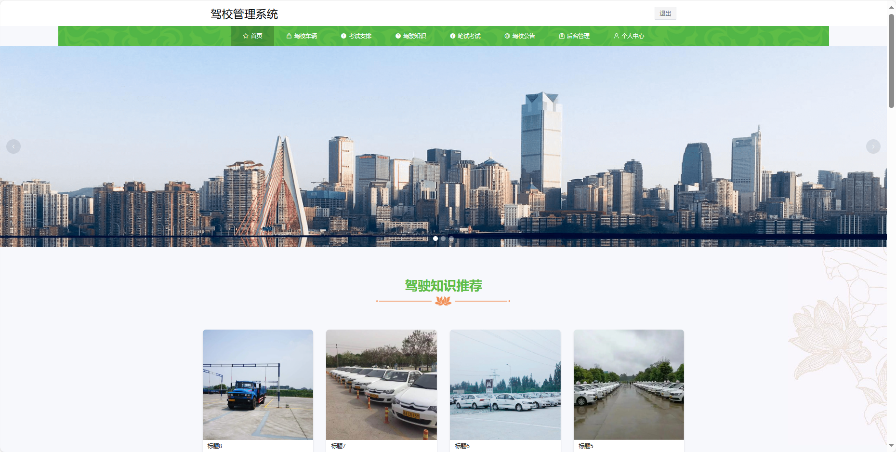
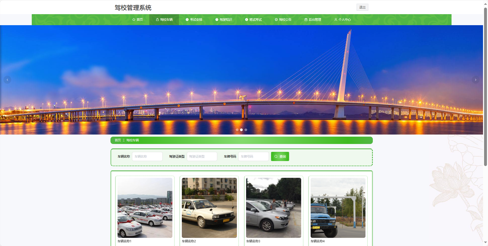
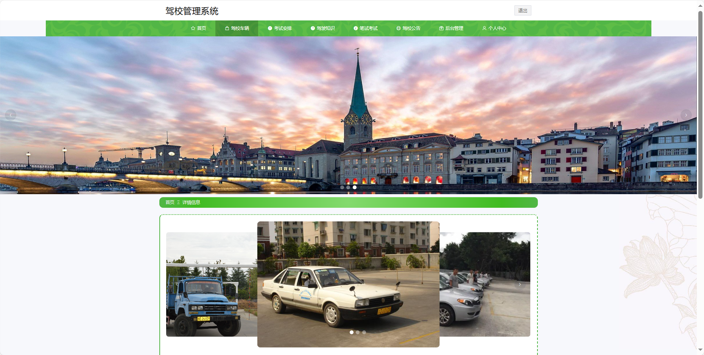
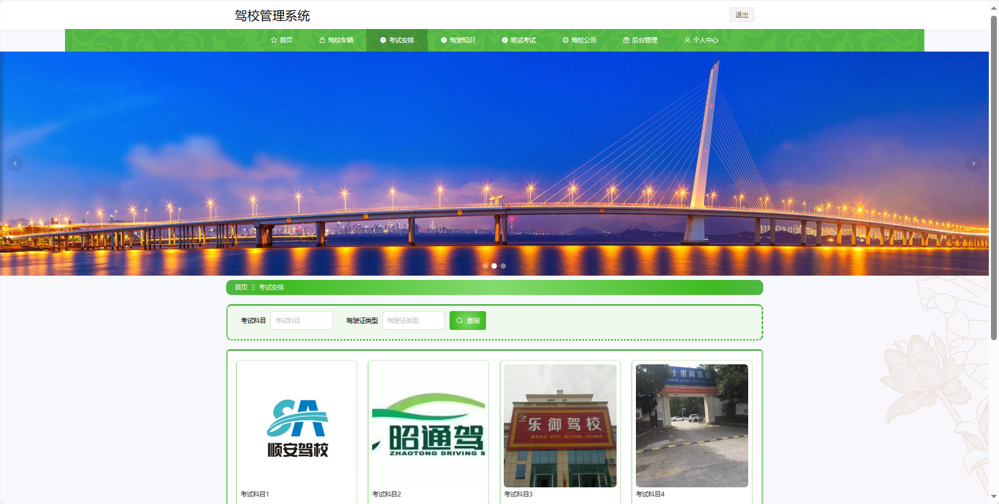
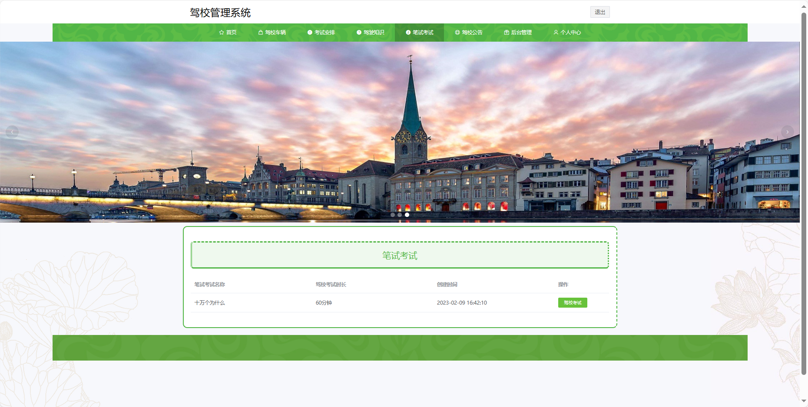
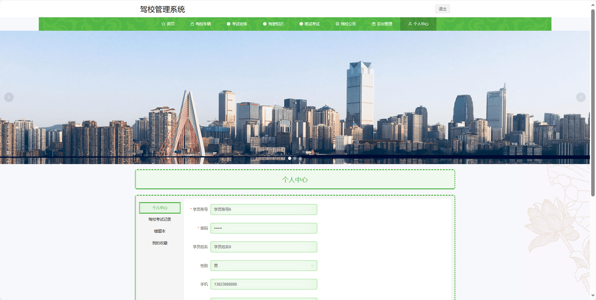
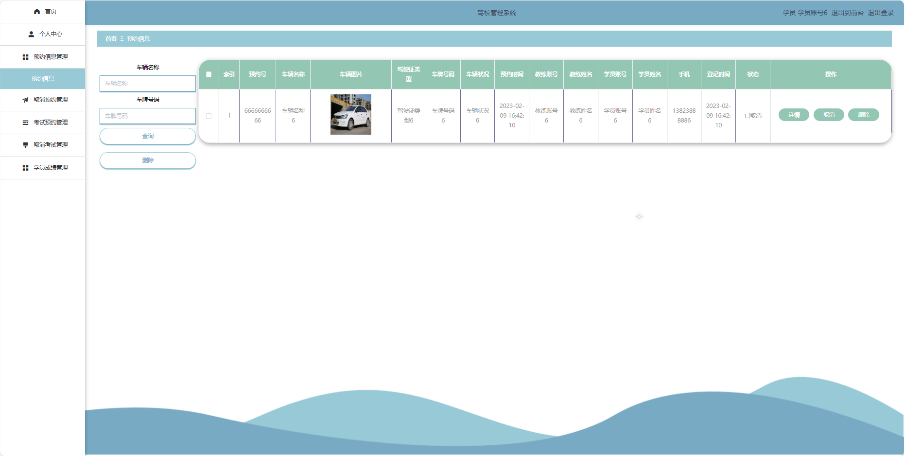
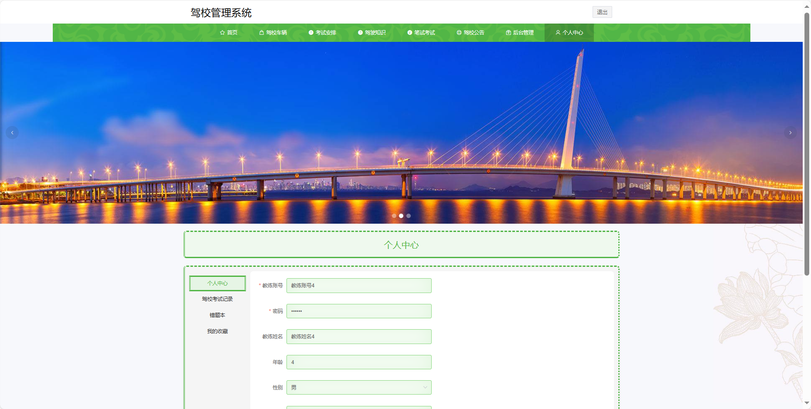
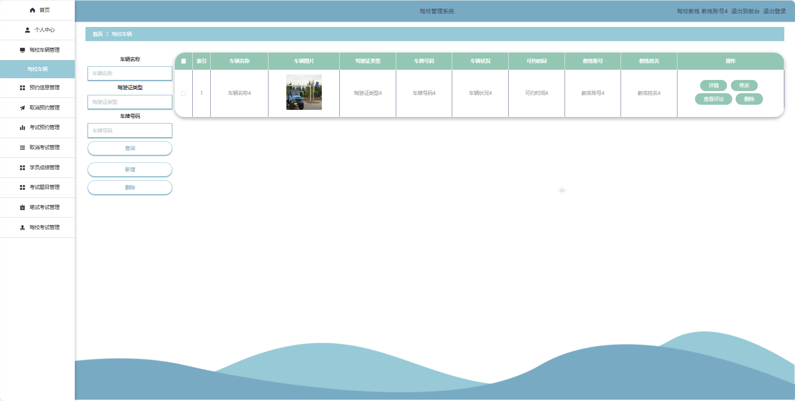

## 基于SpringBoot的驾校管理系统

- <b>完整代码获取地址：从戎源码网 ([https://armycodes.com/](https://armycodes.com/))</b>
- <b>技术探讨、资料分享，请加QQ群：692619798</b> 
- <b>作者微信：19941326836  QQ：952045282</b> 
- <b>承接计算机毕业设计、Java毕业设计、Python毕业设计、深度学习、机器学习</b>
- <b>选题+开题报告+任务书+程序定制+安装调试+论文+答辩ppt 一条龙服务</b>
- <b>所有选题地址 ([https://github.com/YuLin-Coder/AllProjectCatalog](https://github.com/YuLin-Coder/AllProjectCatalog)) </b>

## 项目介绍
基于SpringBoot的驾校管理系统，系统包含三种角色：管理员、学员,教练主要功能如下。

【学员功能】
1. **首页：** 获取驾校最新信息。
2. **驾校车辆：** 查看驾校提供的车辆信息。
3. **考试安排：** 查看个人的考试安排和时间表。
4. **驾驶知识：** 学习和获取驾驶知识。
5. **笔试考试：** 进行驾驶笔试模拟考试。
6. **驾校公告：** 浏览驾校发布的公告信息。
7. **后台管理：** 管理个人预约信息、取消预约、考试预约、取消考试和学员成绩。

【管理员功能】
1. **首页：** 查看整体系统。
2. **个人中心：** 修改密码和管理个人信息。
3. **学员管理：** 管理学员信息，包括注册和审核。
4. **驾校教练管理：** 管理教练信息，包括教练的资质和审核。
5. **驾校车辆管理：** 管理驾校提供的车辆信息。
6. **预约信息管理：** 管理学员的预约信息，包括取消预约和考试预约。
7. **取消预约管理：** 处理学员取消预约的请求。
8. **考试安排管理：** 管理驾校的考试安排。
9. **考试预约管理：** 管理学员的考试预约信息。
10. **取消考试管理：** 处理学员取消考试的请求。
11. **驾驶知识管理：** 发布和管理驾驶知识的内容。
12. **学员成绩管理：** 查看和管理学员的考试成绩。
13. **笔试考试管理：** 管理学员的笔试考试，包括题目发布和评分。
14. **考试题目管理：** 管理驾校的考试题目，包括新增、编辑和删除。
15. **系统管理：** 管理系统的基本设置，包括系统简介、轮播图等。
16. **驾校考试管理：** 查看错题本、笔试考试列表和驾校考试记录。

【教练功能】
1. **首页：** 查看驾校信息。
2. **驾校车辆：** 查看驾校提供的车辆信息。
3. **考试安排：** 查看教练个人的考试安排和时间表。
4. **驾驶知识：** 学习和获取驾驶知识。
5. **笔试考试：** 进行驾驶笔试模拟考试。
6. **驾校公告：** 浏览驾校发布的公告信息。
7. **后台管理：** 管理个人预约信息、取消预约、考试预约、取消考试和学员成绩。

## 项目技术
- 编程语言：Java
- 数据库：MySQL
- 项目管理工具：Maven
- 前端技术：HTML、CSS、JavaScript、Jquery、Vue
- 后端技术：Spring、SpringMVC、MyBatis

## 运行环境
- JDK版本：JDK1.8及以上
- 开发工具：IDEA、Ecplise、Myecplise都可以
- 数据库: MySQL5.7及以上
- Maven：maven3.0及以上
- Node：14.14.0及以上

## 运行截图

